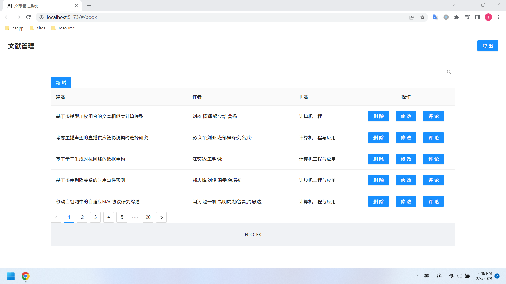

# 安装

## 环境准备

|类型|最低内存|推荐内存|操作系统|依赖|
|:-:|:-:|:-:|:-:|:-:|
|主机|6GB|8GB|CentOS|Docker|
|终端|1GB|2GB|Windows|OpenJDK、Maven、NPM、Python|

## 配置

配置 `/etc/hosts` 文件，进行映射，

```
192.168.72.1   windows
192.168.72.128 centos
```

## 启动

1，在主机处，启动 Docker 容器；

```
$ cd document/docker
$ docker compose -d
```

2，在主机处，创建数据库和数据表；

```
$ cd document/sql
$ mysqladmin -hcentos -uroot -proot create db
$ mysql -hcentos -uroot -proot db < db.sql
```

3，在终端处，运行 Spring Boot 项目；

```
$ cd book
$ mvn spring-boot:run
```

4，在终端处，运行 Vue.js 项目;

```
$ cd book-vue
$ npm run dev
```

5，在终端处，访问 Vue.js 项目，注册并登录，获得口令，例如，

```
satoken=18b0830f-1671-4f56-9186-be3a5c00e0dd
```

6，在终端处，运行 Python 脚本向数据库中添加查询，其中，口令通过上一步骤获得；

```
$ cd document/utils
$ python init.py --file init.csv --url http://windows:8080/book/create --cookie satoken=18b0830f-1671-4f56-9186-be3a5c00e0dd
```

7，在终端处，访问 Vue.js 项目，查看添加情况，

